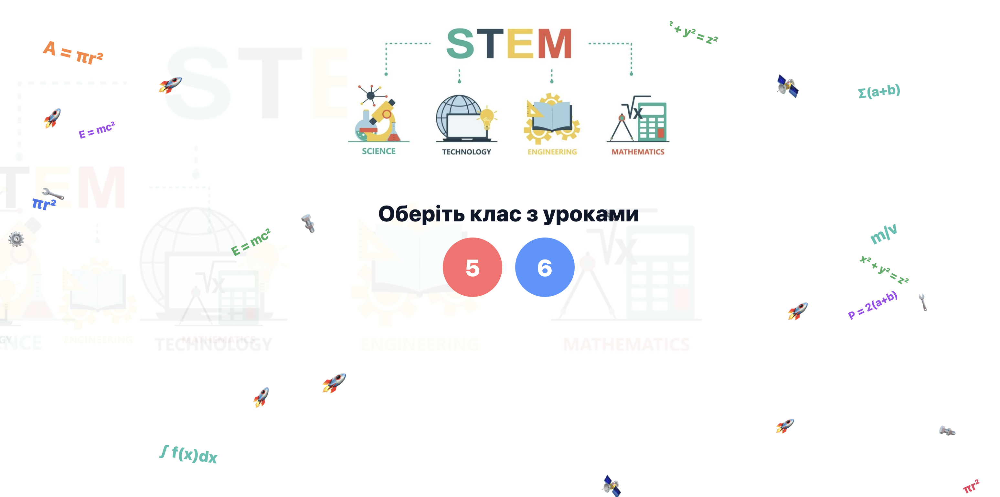
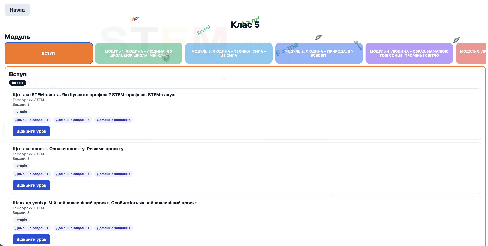
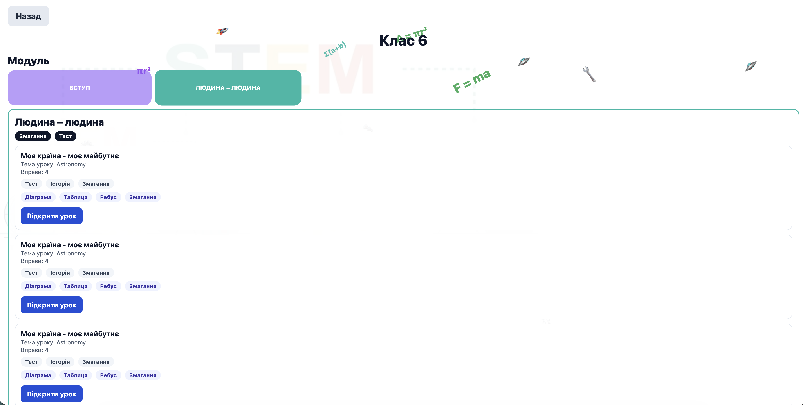
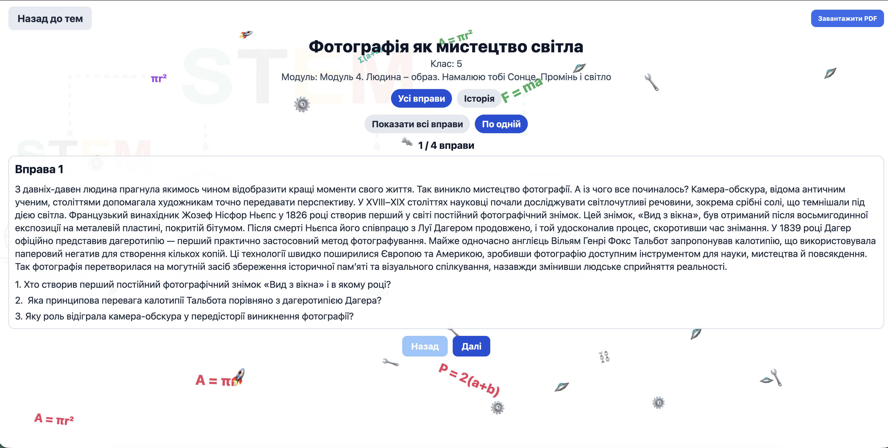
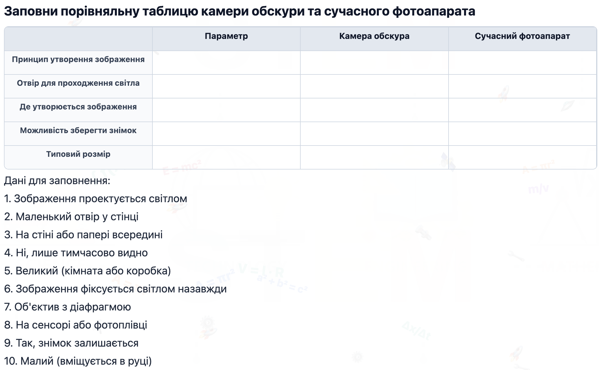
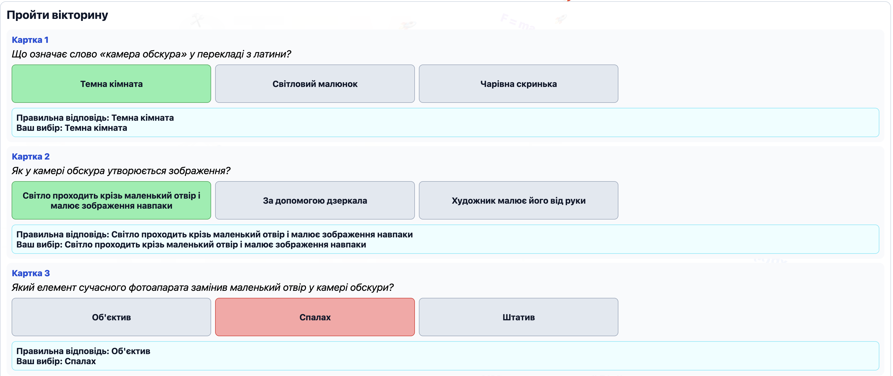
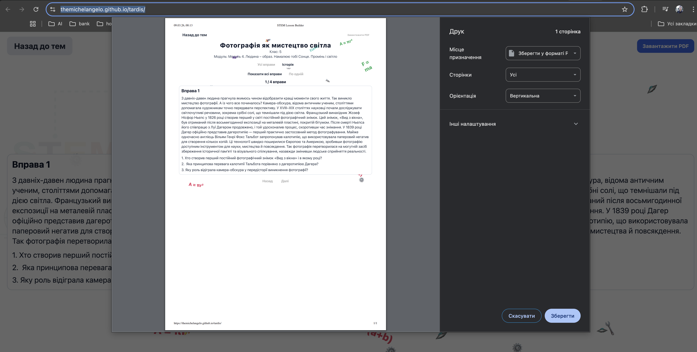

# STEM Lesson Builder

[Українська версія](./README.md)

React Native (Expo) app targeting web first and Android.

## Main flow

- Home page uses white base and displays `src/data/stem_logo.jpeg`.
- Home page has colorful round class buttons: `5` and `6`.
- Opening a class shows theme tabs (each tab has its own color).
- Each theme tab shows lessons and available lesson formats.

## Language config

- Current UI/data language is configured in:
  - `src/config/appConfig.ts` (`currentLanguage: 'en' | 'ua'`)
- Current data storage type is configured in:
  - `src/config/appConfig.ts` (`dataStorage: 'json' | 'sqlite'`)
- Localized labels are stored in:
  - `src/localization/index.ts`

## Lesson exercise model

Each lesson has `exercises` (or `exersices` for compatibility).

Exercise fields:

- `id`: string
- `label`: instruction text
- `formats?`: optional list of formats (`quiz`, `story`, `competition`, `all`)
- `type`: one of
  - `diagram` (image path `src/data/<lesson-id>/<exercise-id>.<ext>`)
  - `table` (`columns`, optional `rows`, `dataToFill`)
  - `text` (`text`, optional `questions`)
  - `rebus` (image path `src/data/<lesson-id>/<exercise-id>.<ext>`)
  - `video` (`youtubeUrl`, optional `questions`)
  - `interactive_quiz` (`questions[]` with `singleChoice`, `trueFalse`, `shortText`)
  - `homework` (`text`, optional `imageExt`, optional `videoUrl`; image path `src/data/<lesson-id>/<exercise-id>.<ext>`)

`homework` is always visible regardless of selected format.

## Exercise type examples

```json
{
  "id": "diagram-1",
  "label": "Label the diagram parts",
  "type": "diagram",
  "imageExt": "png"
}
```

```json
{
  "id": "table-1",
  "label": "Fill the table",
  "type": "table",
  "columns": ["Parameter", "Value"],
  "rows": ["Row 1", "Row 2"],
  "dataToFill": ["Mass", "12 kg", "Force", "5 N"]
}
```

```json
{
  "id": "text-1",
  "label": "Read and answer",
  "type": "text",
  "text": "Light travels in straight lines in a uniform medium.",
  "questions": ["What is a uniform medium?", "Give one example."]
}
```

```json
{
  "id": "rebus-1",
  "label": "Solve the rebus",
  "type": "rebus",
  "imageExt": "jpg"
}
```

```json
{
  "id": "video-1",
  "label": "Watch the video",
  "type": "video",
  "youtubeUrl": "https://www.youtube.com/watch?v=VAgt2vo9HdE",
  "questions": ["What was the main idea?", "Which example do you remember?"]
}
```

```json
{
  "id": "quiz-1",
  "label": "Mini flashcards",
  "type": "interactive_quiz",
  "questions": [
    {
      "id": "q1",
      "question": "What is the unit of force?",
      "answerTypes": {
        "singleChoice": ["Newton", "Watt", "Pascal"],
        "trueFalse": "True",
        "shortText": "Newton"
      }
    }
  ]
}
```

```json
{
  "id": "homework-1",
  "label": "Homework",
  "type": "homework",
  "text": "Prepare one real-life example of friction.",
  "imageExt": "png",
  "videoUrl": "https://www.youtube.com/watch?v=VAgt2vo9HdE"
}
```

## Data configs

Language-specific class files:

- `src/data/5_class_stem_lesson_en.json`
- `src/data/6_class_stem_lesson_en.json`
- `src/data/5_class_stem_lesson_ua.json`
- `src/data/6_class_stem_lesson_ua.json`

## Storage behavior

- Storage backend is selected via `appConfig.dataStorage`.
- `json`:
  - Web: class + language specific `localStorage` keys.
  - Android/iOS: class + language specific JSON files in Expo document directory.
- `sqlite`:
  - App uses `expo-sqlite` with a local `stem_lesson_builder.db` database.
  - `class_lessons` stores module data and generated lessons per class/language.
  - `navigation_state` stores the last navigation state.
- On load, the app always takes the latest module/theme config from the language JSON files and merges it with saved user lessons.

### SQLite migrations

- SQL migration files live in:
  - `src/data/db/migrations/001_create_storage_tables.sql`
  - `src/data/db/migrations/002_seed_navigation_state.sql`
- The SQLite storage provider runs migrations when the database is opened for the first time.
- Read/write logic is isolated in dedicated storage components:
  - `src/lib/dataStorage/jsonDataStorage.ts`
  - `src/lib/dataStorage/sqliteDataStorage.ts`
  - `src/lib/dataStorage/index.ts`

## Run

```bash
npm install
npm run web
```

`npm install` also installs `expo-sqlite`, which is required for `dataStorage: 'sqlite'`.

For Android:

```bash
npm run android
```

## Demo - Web Version

### Main Page

Class selection and lesson setup page.

### Class Selection with Themes

Theme selection page showing available lessons within each theme.

### Lesson Theme Details

Theme selection page showing available lessons within each theme.

### Exercise Filtering by Format
Lessons support different formats for adapting to various learning methods:

- **Story** - narrative format for theory learning
- **Competition** - competitive format for active learning
- **Quiz** - test format for knowledge assessment
- **All** - all available exercises

### Lesson Example

Detailed view of selected lesson with description and exercises.

### Rebus Exercise

Interactive rebus for developing logical thinking.

### Table Exercise

Filling tables for knowledge structuring.

### Quiz

Knowledge testing in interactive quiz format.

### Video Exercise

Learning material through educational videos.

### Homework

Creative assignments for independent work.

### Print Version

Optimized version for printing educational materials.
